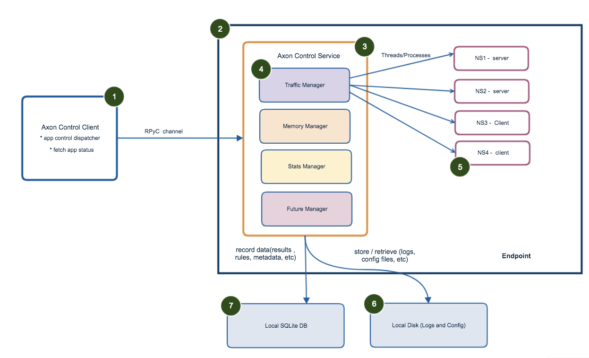

validation-app-engine
=====================

.. contents::

Overview
~~~~~~~~

Why Required ?
**************

Distributed Workload Resource Validation and Metrics Collection is a key aspect of scale testing today.
resources can be Network Resource, Memory Resource etc.

Currently, available resource validators don't scale economically and are limited when it comes to customization.
Metrics and Analytics tools are also extremely expensive and do not always work with some products.
That may not be generating metrics that are compatible with the platform. Reliability and Serviceability
testing is not fully automated today as teams struggle to simulate user workloads and analyze the data from
the same. Products need metrics to measure performance and reliability.

What is Validation App Engine ?
*******************************

**validation-app-engine** an agent based distributed workload resource validation and monitoring engine that lets various
quality and reliability engineering teams to validate their products at large scale.
The remote agents can be programmed to generate resource patterns OR monitor resources and send back information
to a central analytics layer for further analysis teams can make several inferences by analyzing the data generated.

Target Audiance
***************
* Quality Teams
* Performance Engineering Teams
* Chaos/Reliability Engineering Teams
* Development Teams

Key Highlights
**************
* Framework agnostic.
* Platform agnostic (Windows / Linux).
* It also support validation against Linux network namespaces.
* Cloud agnostic (vSphere, AWS, Azure).
* Self-contained Repo / Binaries.
* Support for client / servers running on any port.
* Integration with any DB (natively works on SQLite DB and RiakDB).
* Utility for validating Traffic, Resource and Realization patterns.
* Build utilities on top of it to manage or monitor remote endpoints.

Architecture
~~~~~~~~~~~~

As per current architecture, it can support number of resources.
Currently it supports only network resources, where it generates, validates and monitor network traffic.
In future, other resources support can be added based on interfaces provided in the code.
Under network resource it supports -

* Distributed traffic generation
* Validating traffic patterns
* Traffic rule realization
* Local and central store of traffic stats.

Installation
~~~~~~~~~~~~
Please refer `Installation Guide`_ for detailed installation.

.. _Installation Guide: doc/INSTALL.rst

Network Resource Realization and Validation
~~~~~~~~~~~~~~~~~~~~~~~~~~~~~~~~~~~~~~~~~~~

Supported Protocols/Modes
*************************
Protocols -
    * TCP
    * UDP

Modes -
    * Client
    * Server

Topology and workflow
*********************
Please refer `Workflow Guide`_ for detailed description on basic topologies and workflow.

.. _workflow guide: doc/topology_workflow.rst

How to validate traffic
***********************
Please refer `Example Traffic Validation Guide`_ for detailed example on how to generate, realize traffic rules and validate traffic.

.. _Example Traffic Validation Guide: doc/how_to/how_to_validate_traffic.rst
