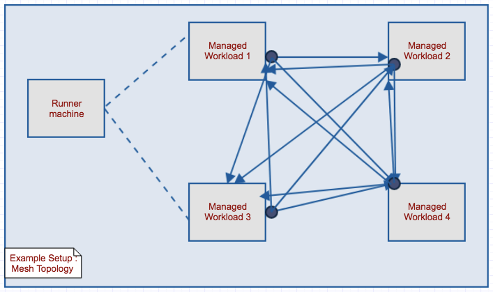

.. contents::

Example Setup
********************

**Mesh Traffic Topology for TCP/UDP***
Lets assume we have one setup having few workloads in given network.
All the workloads need to send TCP and UDP traffics to each other.
On this given setup and traffic needs to be validated against pre set traffic rules
i.e. As it is a mesh Topology for TCP/UDP, for validation we need to check that every single host should communicate to other host and traffic should be allow.

Below is example setup topology::

    * Runner machine - This VM is used to initialize axon traffic using client APIs.
    * In below setup, runner VM can be any of workloads available in network or standalone machine.
    * All the workload VMs must have accessibility from runner machine.

validation-app-engine requirements::

    * All the VMs (Including runner) must have installed validation-app-engine. (Please refer Installation guide for validation-app-engine installation.)
    * On Runner, axon service is not required to run although installation is required.
    * On workload VMs axon service must be running (Please Installation guide for service start etc.)

Traffic Validation
******************

* Generate Traffic rules (Axon User will be owning this)
* Register traffic rules to Axon
* Start Traffic
* Verify traffic validation

Generate Traffic rules
~~~~~~~~~~~~~~~~~~~~~~
* Traffic rule generation is left to axon user.
* Each user will have their own kind of setup and they will need thier own kind of traffic flow.
* For example, which VM is connected to which other VMs, whether traffic is allowed between VMs or not, these kind of information is upto the setup adminstrator.
* APIs are exposed to create Rules, user only needs to create a set of rules using exposed API and then feed it to validation-app-engine.
* Thus validation-app-engine is pushed with traffic rules created in predefined form.
* So rule creation is left to the the user and should be in this format::

    TrafficRule(Endpoint(source), Endpoint(destination), Port(12345), Protocol.TCP, Connected.CONNECTED, Action.ALLOW)
    where -
    * source  - source IP
    * destination -   destination IP
    * Port - destination port, where server is running
    * Protocol - TCP/UDP
    * connected - Path exists between source and destination.
    * action - Allow traffic or drop traffic

    If connected is 'Connected.DISCONNECTED', means path doesn't exits between two VMs.
    And in this case action will not be considered.

**Example of rule creation in above given example can be explained as below**::

        ##############################################################################################################################################
        # we have all the host details in given topology.                                                                                            #
        # Managed Hosts : hosts which we can access each other.                                                                                      #
        #                                                                                                                                            #
        # So pseudo example of single rule will look like -                                                                                          #
        #                                                                                                                                            #
        # ['managed host 1' has (TCP, 12345) access of 'managed host 2', 'managed host 3' and 'managed host 4'                                       #
        ##############################################################################################################################################

        from axon.client.traffic_elements import TrafficRule, \
            Endpoint, Port, Protocol, Action, Connected
        from axon.client.basic_traffic_controller import BasicTrafficController

        class BasicL2ConnectivityTest(object):
            """
            Basic L2 Connectivity Test.
            """
            def __init__(self, managed_hosts):
                self.managed_hosts = managed_hosts

            def _create_allow_rules_on_hosts(self, source, destinations):
                rule_list = []
                for destination in destinations:
                    rule_list.append((TrafficRule(Endpoint(source),
                                      Endpoint(destination),
                                      Port(12345), Protocol.TCP,
                                      Connected.CONNECTED, Action.ALLOW)))
                    rule_list.append((TrafficRule(Endpoint(source),
                                      Endpoint(destination),
                                      Port(12345), Protocol.UDP,
                                      Connected.CONNECTED, Action.ALLOW)))
                return rule_list

            def create_rules_with_given_hosts(self):
                """
                Params:
                managed_hosts: list of hosts which can access each other
                """
                rule_list = []
                for index, host in enumerate(self.managed_hosts):

                    # Form simplicity we are considering each host is sending traffic to other 10 destinations
                    managed_destinations = (self.managed_hosts[:index][::-1][:5] +
                                            self.managed_hosts[index+1: index+6])
                    allow_rules = self._create_allow_rules_on_hosts(
                        host, managed_destinations)
                    rule_list.extend(allow_rules)
                return rule_list

        managed_hosts = ['1.2.3.4', '1.2.3.5', '1.2.3.6', '1.2.3.7']
        basic_test_obj = BasicL2ConnectivityTest(managed_hosts)
        traffic_rules = basic_test_obj.create_rules_with_given_hosts()

Register traffic rules
~~~~~~~~~~~~~~~~~~~~~~

In step 1 we have created traffic allow and deny rules based on our example setup topology.
Next step is to push these rules to validation-app-engine system.
For basic use case where all the source and destinations are 1-1 mapped (No namespace is considered.), we will be using BasicTrafficController from axon client

To push all the rules to validation-app-engine system. here is the code snippet::

        from axon.client.basic_traffic_controller import BasicTrafficController
        gw_host = None # Put IP of jump host if you have workloads behind a jump host
        controller = BasicTrafficController(gateway_host=gw_host)
        controller.register_traffic(traffic_rules)

Start Traffic
~~~~~~~~~~~~~

So far we have covered two mandatory steps of creation rules and pushing that to validation-app-engine system.
Now lets start traffic servers and clients::

        from axon.client.basic_traffic_controller import BasicTrafficController
        gw_host = None # Put IP of jump host if you have workloads behind a jump host
        controller = BasicTrafficController(gateway_host=gw_host)
        controller.start_traffic()

Now we have started all the available servers and clients based on pushed traffic rules on all the effective workload VMs.

Traffic Validation
~~~~~~~~~~~~~~~~~~

If central DB (RIAK) is integrated with your setup (RIAK_IP is set in axon.conf for linux and set in user data in windows), we can have per host traffic stats as well.
Here is how we can get the stats::

        from axon.client.axon_client import AxonClient
        proxy_host = None # Put IP of jump host if you have workloads behind a jump host
        host = '1.2.3.4' # For example, you want stats of VM '1.2.3.4'

        start_time = time.time
        time.sleep(30)
        end_time = time.time

        client = AxonClient(host, proxy_host=proxy_host)
        client.stats.get_success_count(start_time=start_time, end_time=end_time, destination=None, port=None)
        client.stats.get_failure_count(start_time=start_time, end_time=end_time, destination=None, port=None)

In ideal case there should not be any failures in system.
In this way you can validate you traffic stats.
