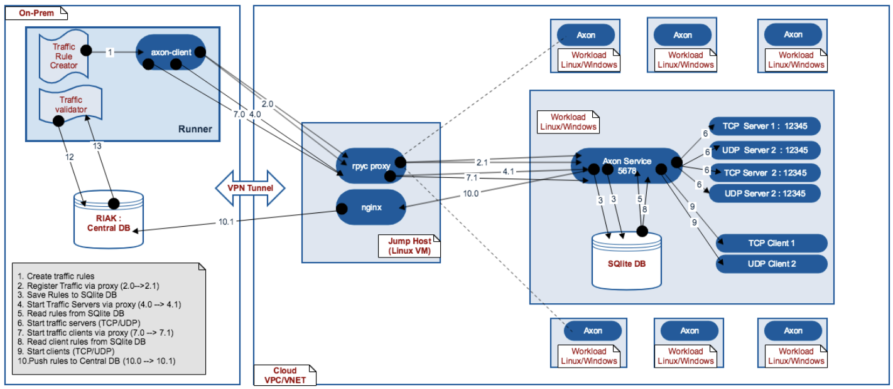

.. contents::

Hybrid Mode Workflow (On-prem + Public Cloud)
=============================================

Here Hybrid mode workflow given on-prem and public cloud (AWS/Azure/GC cloud)is explained.
But this is true for any hybrid mode workspace.

In public cloud, workloads might not be directly accessible directly.
The may be accessible from a jump host in public cloud network.

Here is example workflow for Hybrid mode mode -

Setup Details
~~~~~~~~~~~~~

Complete setup is segregated in two parts

    #. Private Cloud (Datacenter) Setup (Client side)

    #. Public Cloud Setup (Service Side)

Installation
************

Please refer `install_doc`_.

.. _install_doc: INSTALL.rst

On-Prem Setup
~~~~~~~~~~~~~

In the on-prem side all the activities are carried by runner VM. We can think of this a client VM.
Runner VM is client side VM which is used to trigger all type of activities on public cloud.
This is why runner acts as a Client Side setup. Runner VMs must have **validation-app-engine** installed.
Apart from runner VM, you might have a central database storage i.e. RIAK DB.
RIAK DB can be used to store traffic generation results remotely at central location.

Traffic Rule Creator
********************

Traffic rule creator is a client side library which is used to generate traffic rules.
validation-app-engine has some default rule creators for basic topology workloads.
Traffic rule is an instruction which instructs axon service to validate against.
Format of the Traffic Rule will look something like::

        [ALLOW TCP traffic on port 12345 from[IPv4Address('15.16.10.80')] to[IPv4Address('15.16.10.112')].,

        ALLOW UDP traffic on port 12345 from[IPv4Address('15.16.10.80')] to[IPv4Address('15.16.10.112')].,

        ALLOW TCP traffic on port 12345 from[IPv4Address('15.16.10.80')] to[IPv4Address('15.16.10.138')].]

Above is list of traffic rules which tells us, traffic from which port and from which source is allowed or denied to which destination.

Each rule should be instantiated using TrafficRule class::

    Rule = TrafficRule(Endpoint(host), Endpoint(destination), Port(12345), Protocol.TCP,  Connected.CONNECTED,  Action.ALLOW)

.. note::
    Traffic rules needs to created by validation-app-engine user by its own scripts/utilities in above format and then it needs to be fed to axon service.
    Different setup has their own connected path which is only known to setup administrator. So creating rules in above format is left to user.
    They can create rules using their own scripts or they can come with their own traffic rule creator.

Axon Client
***********

Axon Client is a client side library which is used to trigger axon operations on axon server.
Registering traffic and starting traffic is few examples of such operations::

    controller = BasicTrafficController(gateway_host=gw_host)
    controller.register_traffic(rule_list)
    controller.start_traffic()

Public Cloud setup
~~~~~~~~~~~~~~~~~~

Public Cloud Setup is  second part of of axon run workflow.
Irrespective of cloud type, **public cloud workloads must have workloads installed with axon service.**
**Along with installation workloads must have axon service running.**
Axon service default port is **5678**

Jump Host
*********
In Public cloud, due to security limitations, we can't directly access workload VMs from on-prem.
Jump host is a virtual machine available in public cloud  VPC/VNET which is used as a proxy to all the requests to and fro from workloads/runner.
Normally we choose a ubuntu 16.04 VM as jump host.
For working setup, we need to have a **rpyc_proxy** service to be ruuning on jump host and act as broker. So that it can proxy the requests from on-prem to cloud.

#. Install rpyc python package on jump host::

    $ pip3 install rpyc

#. Run below command to make some some required changes::

    sudo sed -i '/import rpyc/a rpyc.core.protocol.DEFAULT_CONFIG[\"allow_pickle\"] = True' /usr/local/bin/rpyc_classic.py

#. Create and start axon broker service using below systemd based upstart script.
    * Create 'axon_broker.service' file with below content::

        # axon - Axon daemon Broker
        #
        [Unit]
        Description=Axon Traffic Generaion Service Daemon Broker

        [Service]
        Type=idle
        ExecStart=/usr/local/bin/rpyc_classic.py --host 0.0.0.0 --logfile /var/log/axon_broker/axon_broker.log -q
        StandardOutput=journal+console

        [Install]
        WantedBy=multi-user.target

    * Copy axon_broker.service in '/etc/systemd/system/' directory or whatever is set for upstart scripts.
    * Reload daemons and start broker service::

        $ sudo systemctl daemon-reload

        $ sudo systemctl enable axon_broker

        $ sudo systemctl start axon_broker

#. If you want to set an a remote DB (RIAK) for result store, please ensure a nginx server running on jump host and required proxy server settings are done.

.. note::
    Jump host must be PASSWORD LESS from client runner machine.
    Cloud must allow port 5678(axon service), 18812(broker service), and any other port i.e. riak proxy porty etc.

Workload VMs
************
Workload VMs are the VMs which actually generates traffic using validation-app-engine.
validation-app-engine is installed on each workload VM and comprises of following components::

    Axon Service
    SQlite-DB
    Traffic servers (When triggered by axon service)
    Traffic Clients (When triggered by axon service)
    * Axon Service is  traffic validation service exposed via python rpyc server at default port 5678.
    * Axon Service accepts traffic requests from Axon clients and and performs requested operations.
    * Axon service also save workload's local state (what servers and clients its running) to local SQlite DB in the form of db files.

Axon Service continuously keeps of monitoring its local state using local SQlite DB, and if it finds any thing relevant, it starts traffic servers and clients accordingly in given namespace of interest.

**Default port for TCP/UDP servers is 12345**

Run Workflow
~~~~~~~~~~~~

#. Create traffic rules using Traffic Rule Creator::

    FRONTEND_HOSTS = ['1.2.3.4', '2.3.4.5']
    DB_HOSTS = ['1.2.3.6', '1.2.3.4.7']
    rule_list = list()
    src_dst_pairs = [(src, dst) for src in FRONTEND_HOSTS for dst in DB_HOSTS]
    for src, dst in src_dst_pairs:
        # Update the Action from DROP to ALLOW
        rule = TrafficRule(Endpoint(src), Endpoint(dst), Port(12345), Protocol.TCP, Connected.CONNECTED, Action.ALLOW)
        rule_list.append(rule)
        # Update the Action from DROP to ALLOW
        rule = TrafficRule(Endpoint(src), Endpoint(dst), Port(12345), Protocol.UDP, Connected.CONNECTED, Action.ALLOW)
        rule_list.append(rule)
        # Add one more Rule
        rule = TrafficRule(Endpoint(src), Endpoint(dst), Port(12346), Protocol.UDP, Connected.CONNECTED, Action.ALLOW)
        rule_list.append(rule)
        print rule_list

#. Register traffic rule::

    # Push the traffic
    PROXY_HOST=None
    controller = BasicTrafficController(gateway_host=PROXY_HOST)
    controller.register_traffic(rule_list)
    This successful operation saves traffic rules to local SQlite DB.

#. Start traffic servers wherever required::

    # Push the traffic
    PROXY_HOST=None
    controller = BasicTrafficController(gateway_host=PROXY_HOST)
    controller.start_traffic()

#. Start clients wherever required::

    # Push the traffic
    controller = BasicTrafficController(gateway_host=PROXY_HOST)
    controller.start_traffic()

In-Place Workflow (No jump host required)
=========================================

In case, you want to validate traffic within a given workplace, either 'only on-prem' or 'only cloud',
In that case, no workload will require any extra jump host for access to other workload.

In this case, workflow will be same as above except Jump host presence.
This of above workflow without a jump host.
All other steps etc. will be same as of above.
